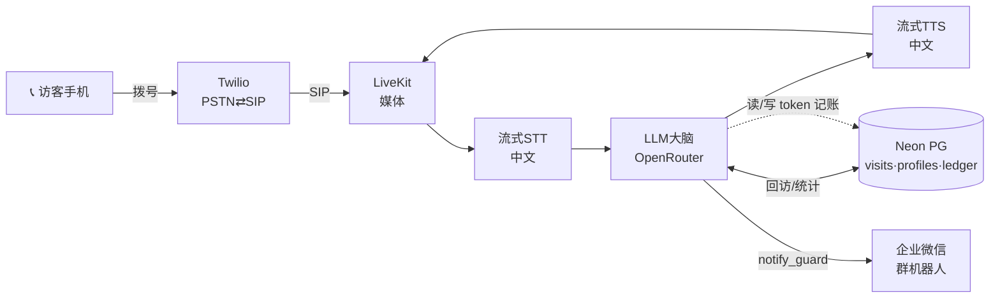

# AgentGuard · 语音门卫访客登记 Voice Agent

驾驶员拨打园区张贴的号码 → AI 门卫自然对话采集访客信息 → 结构化推送至保安企业微信 → 确认放行。
目标：从接通到微信送达 **< 25 秒**，对话**像真人门卫一样自然**（3 轮≈15 秒，非机械问答）。

## 架构



> 完整架构图见 [`docs/diagrams/architecture.mmd`](docs/diagrams/architecture.mmd)。选型理由与 trade-off 见 [`docs/HANDOFF.md`](docs/HANDOFF.md)。

**一句话选型**：自建**链式** pipeline（STT→LLM→TTS）而非端到端语音——为了把 LLM 大脑收敛到 **OpenRouter**（统一计费、读/写 token 可精确对账）并对 slot 填充逻辑保留完全控制；记忆用**精简 Postgres**（结构化访问事件 + 精确聚合）而非图数据库，图-lite 层仅作能力展示。详见 HANDOFF。

## 部署步骤（本地）

```bash
# 1. 依赖
python -m venv .venv && source .venv/bin/activate
pip install -r requirements.txt          # LiveKit Agents 等

# 2. 配置环境变量
cp .env.example .env                      # 填入下方各项

# 3. 初始化数据库 (Neon)
psql "$DATABASE_URL" -f db/schema.sql

# 4. 启动门卫 Agent worker
python -m app.agent                       # 连接 LiveKit，等待来电

# 5. Twilio 号码 → SIP → LiveKit ingress 已配置后，拨打号码即可 demo
```

> `requirements.txt` / `db/schema.sql` / `app/` 将在实现阶段落地，详见 [`docs/TODO.md`](docs/TODO.md)。

## 环境变量

见 [`.env.example`](.env.example)。核心：`OPENROUTER_API_KEY`、`TWILIO_*`、`LIVEKIT_*`、`STT_*`/`TTS_*`、`DATABASE_URL`、`WECOM_WEBHOOK_URL`。

## 项目文档（harness）

| 文档 | 用途 |
|---|---|
| [PROJECT_PLAN](docs/PROJECT_PLAN.md) | 整体规划 · 架构分层 · 7 天时间线 · 风险登记 |
| [HANDOFF](docs/HANDOFF.md) | 关键决策与 trade-off · 未决项 · **答辩要点** |
| [TODO](docs/TODO.md) | 待做清单（MVP / 加分，按优先级） |
| [PROGRESS](docs/PROGRESS.md) | 已做（按日志记录） |
| [TOKEN_ACCOUNTING](docs/TOKEN_ACCOUNTING.md) | 读/写 token 与成本对账设计 |
