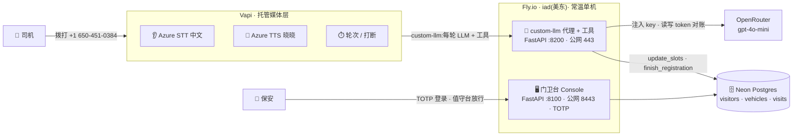
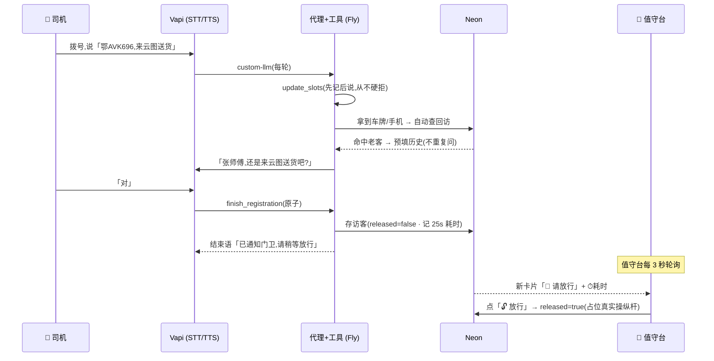
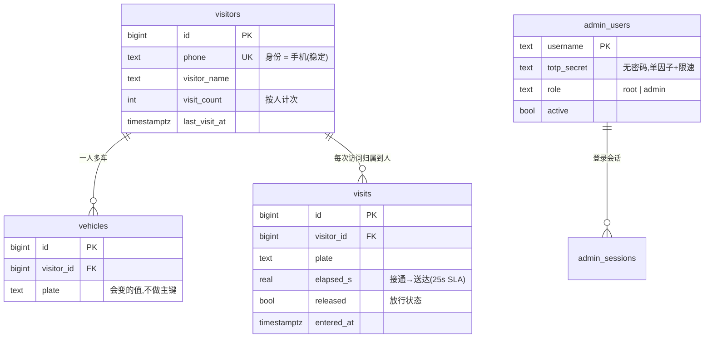

# 🐳 AgentGuard · 语音门卫 Voice Agent

> 司机拨打园区号码 → AI 门卫「小鲸」**自然对话**采集访客信息(车牌 / 单位 / 手机 / 事由)→ 结构化落库并推到**保安值守台** → 门卫**一键放行**。
> 目标:从接通到值守台收到 **< 25 秒**,对话**像真人门卫**(3 轮 ≈ 15 秒,非机械问答)。

**🔴 Live Demo** — 拨打 **`+1 650-451-0384`** · 门卫台 Console `https://agentguard-yj.fly.dev:8443`(TOTP 登录)

---

## ✨ 亮点

- **单 Agent + 工具调用**(非 multi-agent):上下文边界清晰、可靠、便宜。
- **手机为主的规范化身份模型**(一人多车):根治「车牌听花 → 同一人被拆成多条画像」。
- **值守台实时放行** + **对话式增改查(HITL 人工闸门)** + **自然语言查询(NL→SQL 只读)**。
- **无密码 TOTP 2FA** + 服务端会话 + 5 分钟 5 次限速。
- **Fly.io 常温部署** + **GitHub Actions CI/CD**(push 即自动部署)。
- **读/写 token 精确对账**;媒体层与业务解耦(Vapi 今日在用,可无痛迁移)。

---

## 🏗️ 架构



**一句话选型**:媒体(电话+STT+TTS+打断)**租** Vapi;大脑(LLM+工具+数据)**自建**——通过 `custom-llm` 把 Vapi 的 LLM 劫持到我方代理,key 与对账留在自己手里,随时可迁。语音路径要求**不冷启动** → 选 PaaS 常温实例(Fly `min=1`)而非 scale-to-zero serverless。详见 [`docs/HANDOFF.md`](docs/HANDOFF.md) 与决策树 [`docs/diagrams/decisions.mmd`](docs/diagrams/decisions.mmd)。

---

## 📞 一通电话的流程



---

## 🗄️ 数据模型



> **为什么这么建**:身份绑「会变的值」(车牌)会导致二次开发烂掉——所以用 **surrogate id 主键 + 手机唯一键**,车辆一对多。详见 HANDOFF §决策18。

---

## 🖥️ 门卫台 Console 功能

| Tab | 作用 |
|---|---|
| **📟 值守台**(默认首页) | 实时来电号码 + 登记卡片流;新登记「🔔 请放行」→ 一键放行(占位闸机);⏱ 25s SLA 可视 |
| **🐳 门卫台** | 对话式 Agent:读=NL→SQL(只读)、写=定型工具(改访客 / 合并重复画像),**写操作走 HITL 人工确认**;指代不明(多个「张师傅」)先反问再动手 |
| **访客查询** | 一问一答 NL→SQL(只读护栏)+ 结构化搜索 + 统计 |
| **👤 账号管理**(仅 root) | 建管理员(生成 TOTP 二维码)、停用、查看/踢下线会话 |
| **模型切换** | 运行时切 OpenRouter 模型(下一通即生效)+ 单价对账 |
| **通话 Trace** | 每通电话的推理 / 行为 / 延迟 trace(双写 Neon+JSONL) |

---

## 🔐 安全

- **公网代理端点**(`/vapi/{secret}/…`):URL 内嵌密钥,错误密钥 403。
- **门卫台 Console**:**无密码 TOTP 2FA**(Apple 密码 / Google Authenticator)+ **服务端会话**(httpOnly cookie,12h 过期,可即时吊销)+ **5 分钟 5 次限速**。首次 `/setup` 自举根管理员,建成即自禁用。
- **密钥**:全部走 Fly secrets,不进镜像 / 代码;`.env` 已 gitignore。

---

## 🛠️ 技术栈

| 层 | 选型 |
|---|---|
| 电话 + STT + TTS + 打断 | **Vapi**(底层 Azure zh-CN STT/TTS) |
| 大脑 LLM | **OpenRouter · gpt-4o-mini**(经我方 custom-llm 代理) |
| 后端 | **FastAPI**(代理+工具 · 门卫台 console) |
| 数据 | **Neon Postgres** + asyncpg |
| 鉴权 | **pyotp**(TOTP)+ **segno**(二维码)+ 服务端会话 |
| 部署 | **Fly.io**(常温单机 · 两个公网服务)+ **GitHub Actions** CI/CD |

---

## 🧠 大脑模型选型:为什么是 gpt-4o-mini(而非离线更快的 gemini)

模型经过**两轮实测**,结论发生反转——这正是「离线好看 ≠ 真机可靠」的教训。

**第一轮 · 离线合成剧本**([`experiments/brain_test.py`](experiments/brain_test.py),4 个候选跑同一司机剧本):`gemini-2.5-flash-lite` **各项最优**,一度选为默认。

**第二轮 · 真机可靠性**([`experiments/model_eval.py`](experiments/model_eval.py),各模型真机跑 3 次):`gemini-2.5-flash-lite` **翻车**——第 3 通 **0 次工具调用**、纯聊天却假装「已通知门卫」、**零落库**(正是 `finish_registration` 原子收尾要防的幻觉)。改用工具调用最稳的 `gpt-4o-mini`,**3/3 可靠**。

| 维度 | gemini-2.5-flash-lite | **gpt-4o-mini** ✅ |
|---|---|---|
| 离线首字延迟 | **0.74s** 🏆 | 0.99s |
| 离线轮次 / token | **4 轮 / 2453 读 +138 写** 🏆 最省 | 相近量级 |
| 离线收齐 | ✅ | ✅ |
| **真机工具调用** | ❌ 不稳(第 3 通 0 调用 · 假装已通知 · 0 落库) | ✅ **3/3 稳定** |
| 成本 读/写 ($/1M tok) | $0.10 / $0.40 | $0.15 / $0.60 |
| 结论 | 离线最快最省,**真机不可靠** | 略贵略慢,**可靠 → 选它** |

**取舍逻辑**:门卫是**安全关键**场景——车停在闸机前,漏一次工具调用 = 司机干等、零记录。**可靠性 > 原始延迟**。gpt-4o-mini 贵约 50% 的 token 单价在总成本里可忽略(LLM 仅占每分钟成本 ~1%,见下「成本估算」),却换来 OpenAI 系函数调用的稳定;中文略弱但大脑只吐短句、音频由 Azure 扛,影响小。

> 长期硬化路径见 [HANDOFF 决策 16](docs/HANDOFF.md) 的**方案 C**:在我方代理内用 `tool_choice` **强制**工具调用 + 代码校验,让可靠性**与模型脱钩**——结构级保证 > 概率。

---

## 💰 成本估算

结构上是「**租媒体(Vapi)+ 自建大脑(OpenRouter)**」,所以成本 **~90% 在 Vapi 每分钟通话费**,而**大脑几乎免费**。

**① 单分钟成本(变动,随通话分钟)**

| 项 | ~$/分钟 | 说明 |
|---|---:|---|
| Vapi 平台费 | 0.050 | 固定平台抽成 |
| 电话(入站) | 0.010 | 美国本地入站号,经 Vapi/Twilio |
| STT 语音转文字(Azure 中文) | 0.016 | 烧 Vapi 的 Azure 共享额度 |
| TTS 合成(Azure 晓晓) | 0.006 | 只按 Agent **说话**那部分算 |
| **LLM 大脑**(我方 gpt-4o-mini) | **0.001** | 经 custom-llm 代理,**几乎免费** |
| **合计** | **≈ 0.083** | 取整按 **~$0.09/分钟** 估(留边际) |

**② 固定月成本(与车流无关)**

| 项 | $/月 | 说明 |
|---|---:|---|
| Fly.io 常温单机(shared-cpu-1x ~512MB) | ~5 | 语音不能冷启动 → `min=1` 常温 |
| Vapi 电话号码租用 | ~2 | 号码月租 |
| Fly 独立 IPv4 | ~2 | 两个公网端口 |
| Neon Postgres | **0** | 免费档足够(自动休眠、0.5GB) |
| **固定合计** | **≈ 9** | |

**③ 月度成本 × 车流**(按均通 **1.5 分钟/通**、~$0.09/分钟;RMB ≈ ×7.2)

| 月车流(通/月) | 通话分钟 | 变动成本 | +固定 | **月合计 (USD)** | ≈ RMB |
|---:|---:|---:|---:|---:|---:|
| 500(小园区) | 750 | $68 | $9 | **≈ $77** | ¥550 |
| 2,000(中型) | 3,000 | $270 | $9 | **≈ $279** | ¥2,000 |
| 5,000 | 7,500 | $675 | $9 | **≈ $684** | ¥4,900 |
| 10,000(大园区) | 15,000 | $1,350 | $9 | **≈ $1,359** | ¥9,800 |

> **每通电话 ≈ $0.14(≈ ¥1)**。

**两个关键杠杆**:
1. **均通时长是最大变量**——设计目标 3 轮 ≈ 15 秒 / <25 秒送达;真跑到均通 1 分钟,全表 **×0.67**。「对话越短越省钱」与「体验越好」**同向**。
2. **换更贵的大脑几乎无感**——瓶颈是 Vapi 分钟费不是 LLM;gpt-4o-mini 比 gemini 贵 50% token,月成本几乎不动。

> ⚠️ 上表为当前**美国号 `+1 650` 的 demo 栈**;国内生产会换国内号码 + 国内 STT/TTS,资费需重算。车流超 ~1 万通/月,自建 STT/TTS 或国内语音直连开始划算(用工程换单价)。

---

## 🚀 部署

线上已跑在 Fly(iad):代理 `agentguard-yj.fly.dev`(443)+ 门卫台 `:8443`。**push 到 `main` 即自动部署**(GitHub Actions:import 冒烟 → `flyctl deploy`)。

```bash
# 手动部署
fly deploy --remote-only

# 首次:密钥进 Fly secrets(不入代码)
fly secrets set OPENROUTER_API_KEY=… DATABASE_URL=… VAPI_API_KEY=… VAPI_SERVER_SECRET=…
```

## 💻 本地开发

```bash
python3.12 -m venv .venv && source .venv/bin/activate
pip install -r requirements.txt
cp .env.example .env          # 填 OPENROUTER_API_KEY / DATABASE_URL / VAPI_* 等
psql "$DATABASE_URL" -f db/schema.sql

uvicorn vapi.tools_server:app --port 8200    # 代理 + 工具(Vapi 打这里)
uvicorn admin.server:app     --port 8100     # 门卫台 → http://localhost:8100
```

**环境变量**(见 [`.env.example`](.env.example)):`OPENROUTER_API_KEY` · `DATABASE_URL` · `VAPI_API_KEY` · `VAPI_SERVER_SECRET` · `WECOM_WEBHOOK_URL`(可空,值守台为主要保安接收面)。

---

## 📚 项目文档

| 文档 | 用途 |
|---|---|
| [HANDOFF](docs/HANDOFF.md) | 关键决策与 trade-off · 未决项 · 答辩要点 |
| [decisions.mmd](docs/diagrams/decisions.mmd) | 关键决策树(每决策点同步更新) |
| [PROJECT_PLAN](docs/PROJECT_PLAN.md) | 整体规划 · 分层 · 时间线 · 风险 |
| [TOKEN_ACCOUNTING](docs/TOKEN_ACCOUNTING.md) | 读/写 token 与成本对账设计 |
| [PROGRESS](docs/PROGRESS.md) · [TODO](docs/TODO.md) | 进度 / 待办 |

---

<sub>7 天 take-home · 上海蓝色鲸鱼科技(whaletech.ai)· 单 Agent · 轻量优先 · 诚实记录 trade-off</sub>
